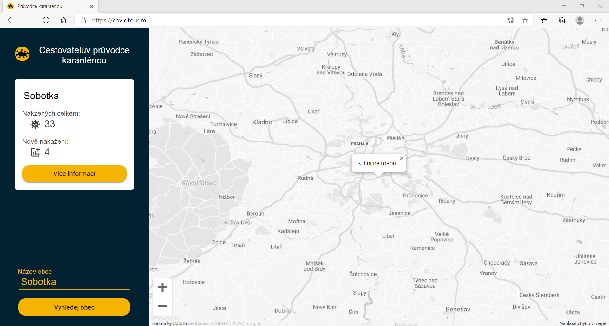
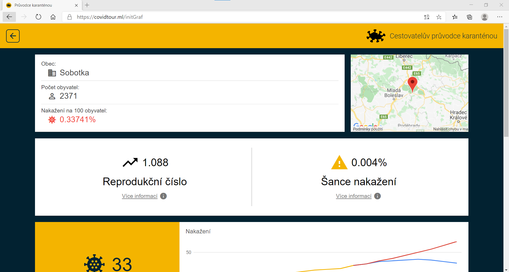
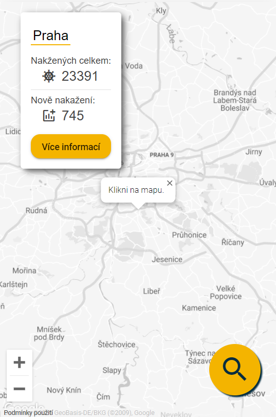
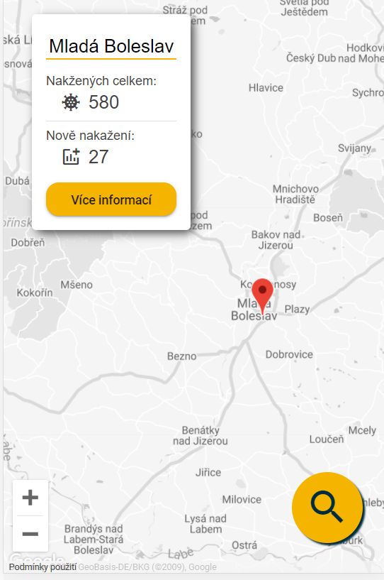
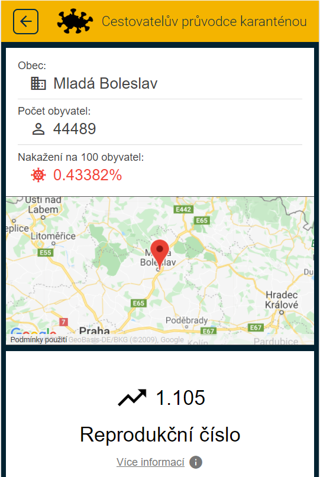
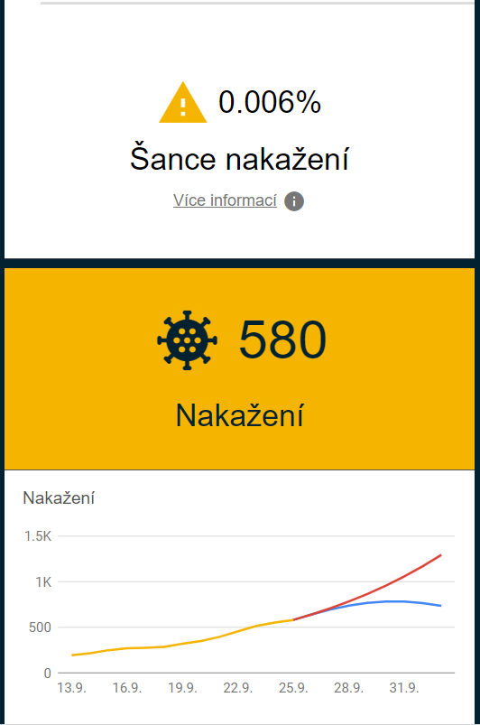

# Cestovatelův průvodce karanténou

- Git: https://github.com/body0/Hradec_2020
- Technologie: angular, google icons, google map api, google geoocation api, google charts, python (flusk; psycopg2), postgres, nginx, gunicorn, docker (docker-compose)
- Opendata: open data MZČR

**Popis**

Cílem projektu bylo vytvořit webovou aplikaci pro odhad rizika nakažení koronavirem v uživateli zvolené lokalitě.

- Uživatel zvolí lokalitu kam chce cestovat
- Aplikace spočítá jaká je pravděpodobnost nákazy v dané oblasti.
- Zobrazí týdenní predikci v dané oblasti.
- Procentuální šance nákazy, vývoj nákazy.

**Usage**

- celá aplikace je připravena pro docker
- docker otevírá na hostujícím serveru port 5432 pro veřejný přístup k databázi a 3101 pro samotnou vebovou aplikaci
- pro nakorování změn do dockeru použijte copy.sh skript v /DOCKER

    ```
    git clone https://github.com/body0/Hradec_2020
    cd DOCKER
    sudo docker-compoer build
    sudo docker-compose run -d
    ```

**Screenshots**








