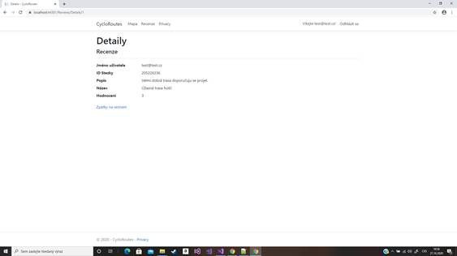
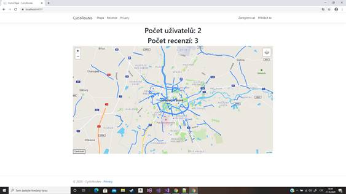
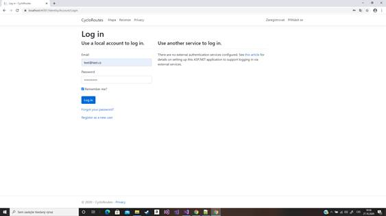
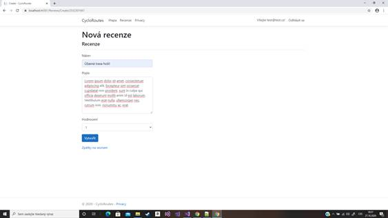
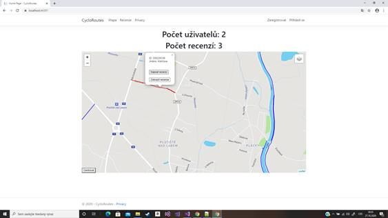
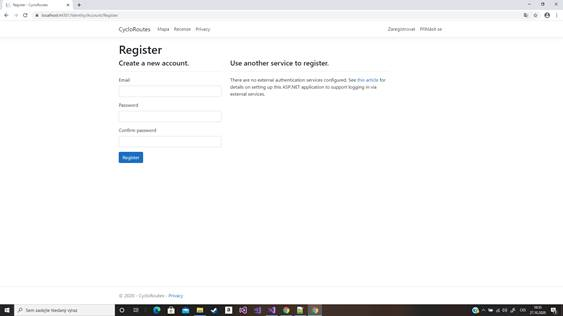
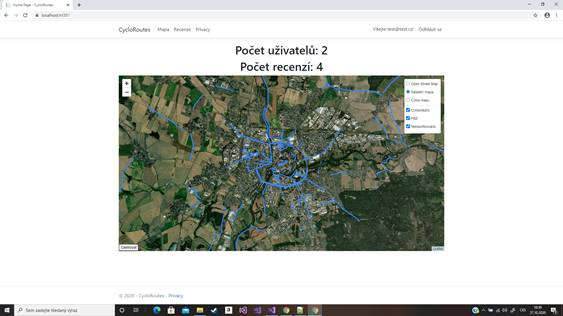
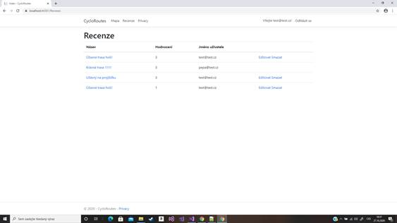
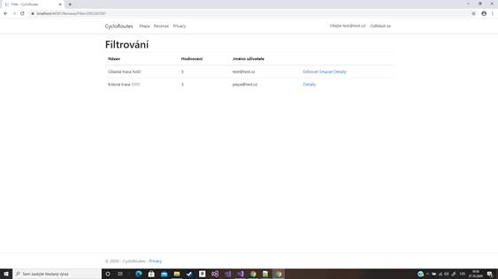

# CykloRoutes

- Git: https://gitlab.com/hackathon_dpd/cycloroutes
- Technologie: Asp .net Core, C#, javascript, mssql, leafletjs, osmAPI
- Opendata: OpenStreetMap

**Popis**

CycloRoutes je aplikace, která využívá otevřená data poskytována projektem OpenStreetMap. Naším cílem bylo vytvořit aplikaci, sdružuje komunitu  lidí, kteří hledají idealní trasy pro cyklisty, běžce a dokonce i invalidy, kteří by si našli ideální cestu z parkoviště, či stezku blízko zastávky MHD, aby si také mohli zasportovat. Ke každé stezce můžete přidávat recenze, aby lidé mohli sdílet své pocity ze stezky a její stavu.

**Usage**

Spustíte webový server -> zaregistrujete se -> přihlásíte se -> vyberete si stezku kterou chcete hodnotit -> napíšete recenzi -> plánujete kam by jste se chtěl projet podle recenzí ostatních.

**Screenshots**

