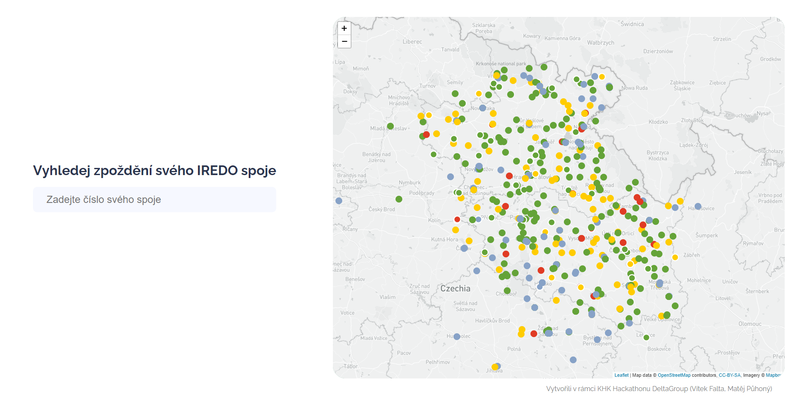
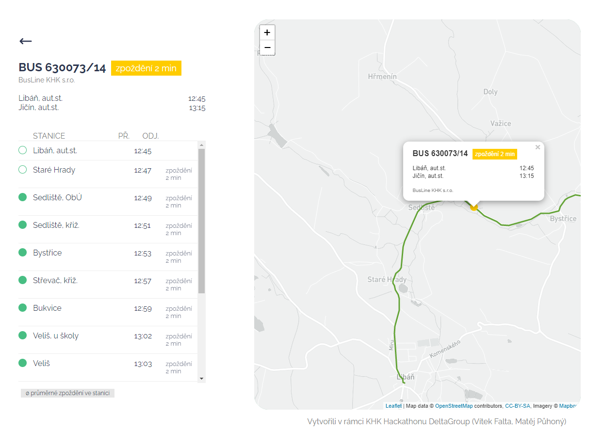

# Hlídač spojů

- Git: https://github.com/GrimirCZ/hackathon
- Technologie: React.js. Laravel + PHP, MySQL (Hostováno na Nginx zabezpečeno SSL)
- Opendata: oredo.cz, čekací doby autobusových linek KHK

**Popis**

Hlídač spojů je systém monitorující současné a bývalé zpoždění vlakových a autobusových spojů. Díky tomu je schopný informovat vaši volbu spoje.

**Usage**

@todo

**Screenshots**

